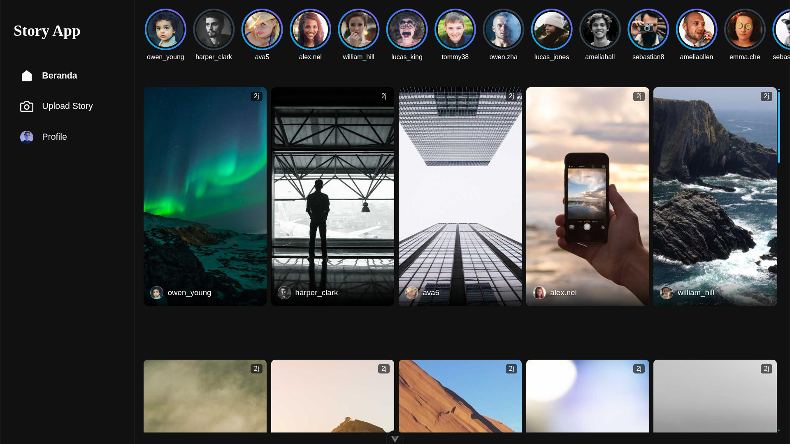

# Instagram Story Clone

This project is a client-side clone of the Instagram Stories feature, built with Vue.js and Vite.



## Features

- **View Stories**: Browse a list of stories from different users.
- **Story Navigation**: Swipe or click through stories in a detailed view.
- **Responsive Design**: The layout adapts to different screen sizes, from mobile to desktop.
- **Mock Backend**: Uses `json-server` to simulate a backend API for fetching user and story data.

## Technologies Used

- **Framework**: [Vue.js](https://vuejs.org/) v3
- **Build Tool**: [Vite](https://vitejs.dev/)
- **Routing**: [Vue Router](https://router.vuejs.org/)
- **UI Libraries**:
  - [NProgress](https://ricostacruz.com/nprogress/): For slim progress bars during navigation.
  - [Vue Virtual Scroller](https://github.com/Akryum/vue-virtual-scroller): For efficiently rendering large lists.
- **Mock API**: [json-server](https://github.com/typicode/json-server)
- **Code Formatting**: [Prettier](https://prettier.io/)

## Prerequisites

- [Node.js](https://nodejs.org/) (Version `^20.19.0` or `>=22.12.0`)
- [npm](https://www.npmjs.com/) (or another package manager like Yarn/pnpm)

## Installation and Setup

1.  **Clone the repository:**

    ```bash
    git clone https://github.com/al-kawsar/24hr-feature-roadmapsh.git story_ig_clone && cd story_ig_clone
    ```

2.  **Install dependencies:**

    ```bash
    npm install
    ```

3.  **Set up environment variables:**

    Create a `.env` file in the root directory by copying the example file:

    ```bash
    cp .env.example .env
    ```

    The `.env` file is used to configure the API's base URL. The default value is `http://localhost:3000`.

    ```
    VITE_API_BASE_URL=http://localhost:3000
    ```

## Available Scripts

### Running the Development Server

To start the local development server with hot-reloading:

```bash
npm run dev
```

The application will be available at `http://localhost:5173` (or the next available port).

### Running the Mock Backend

This project uses `json-server` to provide a mock API. To run it, open a separate terminal and execute:

```bash
npm run db
```

The mock API will be available at `http://localhost:3000`.

### Building for Production

To create a production-ready build of the application:

```bash
npm run build
```

The output files will be generated in the `dist/` directory.

### Previewing the Production Build

To preview the production build locally:

```bash
npm run preview
```

### Formatting Code

To automatically format all files in the `src/` directory using Prettier:

```bash
npm run format
```
